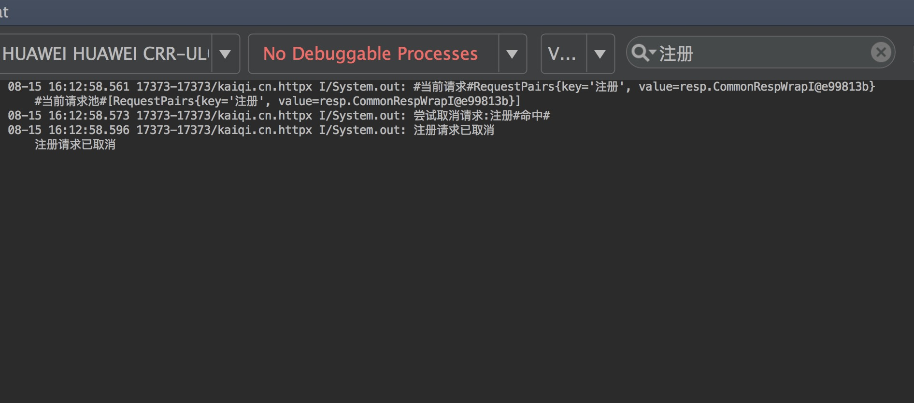

[](https://jitpack.io/#majunm/HttpX)


> 使用方式,如有需要
```
allprojects {
		repositories {
			...
			maven { url 'https://jitpack.io' }
		}
	}
```

```
	dependencies {
    	        implementation 'com.github.majunm:HttpX:v1.0.0-gamma'
    	}
```

#### [参考以前写的文章](https://www.jianshu.com/p/f4952e67f099) 现在提交的是升级版本,总的来说,同一个套路,精简了点代码而已~
#### 初始化工作(必须),支持加密解密,支持日志定制过滤
#### 以下是请求拦截代码片段以及通用参数初始化,加密解密
```
 HttpRequestFactory.doCreateHttpReqManager(this, ResLibConfig.DEBUG ? "http://www.wanandroid.com/" : "http://www.wanandroid.com/")
                 .registerCallbacks(new HttpHeadersImpl() {
                     @Override
                     public Map<String, String> generateHeaders() {
                         Map<String, String> keys = new HashMap<>();
                         //        keys.put("versionCode", "" + IUtil.obtainAppVersionCode(ResLibConfig.CONTEXT));
                         //        keys.put("version", IUtil.obtainAppVersion(ResLibConfig.CONTEXT));
                         //        keys.put("channel", "");
                         //        keys.put("imei", "");
                         //        keys.put("platform", "2");//1:ios 2:Android
                         //        keys.put("model", IUtil.MODEL);
                         //        keys.put("vendor", IUtil.BRAND);
                         return keys; // 请求头注入,如有需要
                     }
                 }).registerCallbacks(new HttpInterceptor() {
             @Override
             public void doInterceptor(int... cmds) {
                 if (cmds != null && cmds.length > 0) {
                     int code = cmds[0];
                     switch (code) {
                         case HttpInterceptor.KICKED_OFF_LINE:
                             //Tools.showToast("用户已在其他设备登录");
                             int value = AUTO_INCREMENT.incrementAndGet();
                             if (value == 1) {
                                 // relogin(); // 调用一次
                             }
                             Logger.e("http", "用户已在其他设备登录|" + value + "|");
                             break;
                         case HttpInterceptor.PROHIBIT_USED:
                             //Tools.showToast("您被禁止使用");
                             break;
                         case HttpInterceptor.PROHIBIT_USEDII:
                             //Tools.showToast("用户被封禁,不能登录");
                             break;
                         case HttpInterceptor.UN_LOGIN:
                             //Tools.showToast("请先登录");
                             //relogin(false);
                             break;
                     }
                 }
             }
         }).asEncryptFuncs(new EncryptFuncs() {
             @Override
             public String encrypt(String plainText) {
                 //return AesEncryptionUtil.encrypt(plainText);
                 return "";
             }

             @Override
             public String decrypt(String cipherText) {
                 //return AesEncryptionUtil.decrypt(cipherText);
                 return "";
             }

             /**
              * {@link ReqTags}
              * {@link kaiqi.cn.httpx.req.RegisterReq}
              * 请给予tag,否则取消不掉请求,拦截不了加密解密赛~
              */
             @Override
             public boolean accept(String httpReaTag) {
                 if ("注册".equals(httpReaTag)) {
                     // return false; // 你们都同意,我注册第一个不答应
                 }
                 return true; // 同意加密
             }
         }).asSubmmitForm(true); // true = 表单提交 false = json提交
```

###### 以下部分摘要信息,来至[玩安卓](http://www.wanandroid.com/)大神的github[点我](https://github.com/hongyangAndroid)
#####  代码大部分来至妇联网,我只是加了点盐,希望各路大神不要打我!!!郑重声明(我只接受女生的挑战,如有打我的需要)
###### step1 构造请求体,必须
```
@ReqTags("注册") // 会当做请求tag,根据tag过滤请求日志和取消请求
public class RegisterReq extends CommonRequest {
    public String username;
    public String password;
    public String repassword;

    public RegisterReq(String username, String password, String repassword) {
        this.username = username;
        this.password = password;
        this.repassword = repassword;
    }

    public RegisterReq() {
    }

    @Override
    public String postfix() {
        return "user/register";
    }
}
```

###### step2 发起请求,方式一

```
  final IProgressDialog iLoading = new IProgressDialog(this);
  final RegisterReq json = new RegisterReq("12132322333", "123456", "123456");
  请求加载框,如有需要的话,传入即可
  HttpRequestFactory.doPost(json, new ResultCallbackAdapt<HttpCommObjResp<RegisterResp>>() {
            @Override
            public void doOnResponse(HttpCommObjResp<RegisterResp> response) {
                System.out.println(response + "");
                mContent.setText("\n方式一返回:" + response);
            }

            @Override
            public void doOnError(ApiException ex) {
                System.out.println(ex + "");
                mContent.setText("\n方式一返回:" + ex);
            }
        }, iLoading);
```

###### step2 发起请求,方式二,返回String,自己手动解析,如有需要

```
  final IProgressDialog iLoading = new IProgressDialog(this);
  final RegisterReq json = new RegisterReq("12132322333", "123456", "123456");
  请求加载框,如有需要的话,传入即可
  HttpRequestFactory.doPost(json, new ResultCallbackAdapt<String>() {
              @Override
              public void doOnResponse(String response) {
                  System.out.println(response + "");
                  mContent.setText("\n方式二返回:" + response);
              }

              @Override
              public void doOnError(ApiException ex) {
                  System.out.println(ex + "");
                  mContent.setText("\n方式二返回:" + ex);
              }
          });
```

###### tips:关于用HttpCommObjResp<RegisterResp> 还是用 HttpCommObjsResp<RegisterResp>

##### 形如格式:
```
{
 "code":200,
 "msg":"成功",
 "data":{}
}
```
###### data = {} 是对象,所以用HttpCommObjResp<RegisterResp>

##### 形如格式:
```
{
 "code":200,
 "msg":"成功",
 "data":[]
}
```
###### data = [] 是数组对象,所以用HttpCommObjsResp<RegisterResp>

我以为所有的接口返回都是这样的,其实并不是
以下是注册返回json

```
{
	"data": {
		"collectIds": [],
		"email": "",
		"icon": "",
		"id": 9073,
		"password": "123456",
		"token": "",
		"type": 0,
		"username": "19910222"
	},
	"errorCode": 0,
	"errorMsg": ""
}
```

为什么不是code,msg??

不过不要怕,照样无缝链接网络调用,提供json,表单两种提交方式|下载,上传这个没上心写!!!


###### 因为暂时支持这几种返回格式的组合,不满足格式的话,如有需要,请修改源码
~~~
{
    "msg":"",
    "code"100,
    "data":{}
}
{
    "errorMsg":"",
    "errorCode"100,
    "data":{}
}
{
    "message":"",
    "error"100,
    "infos":{}
}
{
    ....
    "results":{}
}
~~~

#### 所以放心的用吧
```
 HttpRequestFactory.doPost(json, new ResultCallbackAdapt<String>() {
              @Override
              public void doOnResponse(String response) {
                  System.out.println(response + "");
                  mContent.setText("\n方式二返回:" + response);
              }

              @Override
              public void doOnError(ApiException ex) {
                  System.out.println(ex + "");
                  mContent.setText("\n方式二返回:" + ex);
              }
          });
```

###### 关于取消请求

```
HttpRequestFactory.cancel("注册");//取消单个
HttpRequestFactory.cancel("注册","首页文章列表"); // 取消多个

```

###### 关于加密解密,暂时只支持json加密解密!!!
###### 关于上传,公司项目图片现在都走阿里云,实在是没测试接口了,欢迎大佬们提供测试接口,让我来完善这个库~
###### 关于下载,暂未添加断点续传~
###### 代码还有很多不足之处,请指教


[混淆配置](混淆配置.md)

当日志满天飞,你说我有格式化日志工具类,美倒是美,接口多了,不好找啊,
那怎么样才可以找我想要的接口信息呢?
问的好,请看日志截图,一图胜千言~是不是很清爽,看我所看,爱我所爱.




>>> 为什么要这样写?看下服务端代马

```
	@RequestMapping(value = "/showUser", method = { RequestMethod.GET,
			RequestMethod.POST }, produces = "application/json;charset=UTF-8")
	public JSONObject toIndex(@RequestBody(required = false) String data) {
		return callHttpReqTask(data, TO_INDEX);
	}

	@RequestMapping(value = "/addUser", method = { RequestMethod.GET,
			RequestMethod.POST }, produces = "application/json;charset=UTF-8")
	public JSONObject addUser(@RequestBody(required = false) String data) {
		return callHttpReqTask(data, ADD_USER);
	}
```
每一个请求都有一个RequestMapping
我在每一个请求体上构造一个后缀,岂不是和后台相映成趣.好处呢?
我宁愿构造javabean也不愿意这样传参....
摘至代马,来至哪里不重要~

```
Map<String, String> params = new HashMap<String, String>();
params.put("name", "tsy");
params.put("name", "tsy");
params.put("name", "tsy");
params.put("name", "tsy");
params.put("name", "tsy");
params.put("name", "tsy");
params.put("name", "tsy");
params.put("name", "tsy");
params.put("name", "tsy"); // 每一个接口都初始化 hashmap~  What Fuck ~有点累阿,交给gson多好
MyOkHttp.get().post(this, "http://baidu.com/", params, new JsonResponseHandler() {
    @Override
    public void onSuccess(int statusCode, JSONObject response) {
        LogUtils.v(TAG, statusCode + " " + response);
    }

    @Override
    public void onFailure(int statusCode, String error_msg) {
        LogUtils.v(TAG, statusCode + " " + error_msg);
    }
});
```

还有这样的,如果100个接口,岂不是美滋滋

```
public interface FinanceApiService {
    //POST请求
    @FormUrlEncoded
    @POST("acc/incomeAccounting")
    Observable<ResultBean> incomeAccounting(@Field("incTime") String incTime, @Field("operator") String operator, @Field("paymentMethod") String paymentMethod,
                                            @Field("incomeReason ") String incomeReason , @Field("incMoney") int incMoney, @Field("paymentUnit") String paymentUnit,
                                            @Field("consNumber") String consNumber, @Field("note") String note);
    //GET请求
    @GET("acc/incomeAccounting")
    Observable<ResultBean> incomeAccounting2(@Query("incTime") String incTime, @Query("operator") String operator, @Query("paymentMethod") String paymentMethod,
                                             @Query("incomeReason ") String incomeReason , @Query("incMoney") int incMoney, @Query("paymentUnit") String paymentUnit,
                                             @Query("consNumber") String consNumber, @Query("note") String note);
}

```

现在放弃他们吧....来给我的库贡献代码吧~

构造javabean的好处,key已经写好了,你只需要关注value即可,我觉得比写hashmap快一丢丢~

```
@ReqTags("接口姓甚名谁") // 他还有2个兄弟拓展参数,保留着没用,如果你愿意,可以对他动手脚
public class X extends CommonRequest{
  public String name;
  public String pahone;
  public X(String name,String phone){}
  @Override
  public String postfix() {
        return "user/register";
  }
}

HttpRequestFactory.doPost(new X("xx","yy"), new ResultCallbackAdapt<HttpCommObjResp<RegisterResp>>() {
            @Override
            public void doOnResponse(HttpCommObjResp<RegisterResp> response) {
                System.out.println(response + "");
                mContent.setText("\n方式一返回:" + response);
            }

            @Override
            public void doOnError(ApiException ex) {
                System.out.println(ex + "");
                mContent.setText("\n方式一返回:" + ex);
            }
        ); //不要loading时
        //}, iLoading); // loading,这东西如有需要

        get请求呢,改个名字....即可!!饥渴~~
HttpRequestFactory.doGet(new X("xx","yy"), new ResultCallbackAdapt<HttpCommObjResp<RegisterResp>>() {
            @Override
            public void doOnResponse(HttpCommObjResp<RegisterResp> response) {
                System.out.println(response + "");
                mContent.setText("\n方式一返回:" + response);
            }

            @Override
            public void doOnError(ApiException ex) {
                System.out.println(ex + "");
                mContent.setText("\n方式一返回:" + ex);
            }
        ); //不要loading时
        //}, iLoading); // loading,这东西如有需要

```

# 调用堆栈不深,适合新手阅读源码,有可取之处,给我加star吧

### 转载注明出处 [HttpX](https://github.com/majunm/HttpX)
如有需要 [加密解密库](https://github.com/majunm/encryptanddecrypt)
